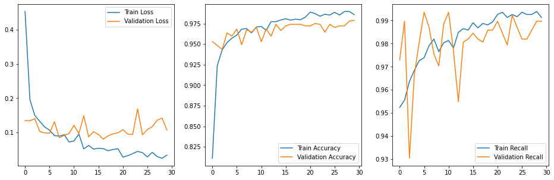

# Pneumonia Image Classification - Neural Network Analysis and Recommendation

**Authors** [Clara Giurgiu](mailto:claragiurgiu@gmail.com), [Vlad Sekiguchi](mailto:vlsekig@gmail.com)

## Overview

For this project we use a Sequential Neural Network model to analyze and recognize pneumonia patterns amongst thousands of patients x-rays. Through an iterative process of enhancing certain features in the images and using a convolutional neural network we were able to improve our model's classification capabilities.

## Business Problem
In order to help the radiology department in our hospital, we were tasked with using deep learning algorithms to streamline detection and diagnosis of pneumonia from x-ray images. Thus, delivering treatment and/or resources to patients in a timely manner and reduce the cost of treating for complications or patients that were misdiagnosed. 

Pneumonia is an infection of the lower respiratory track that can be caused by viruses or bacteria. It results in inflamation of the alveoli, wich are air sacs in the the lungs. This infection can be life-threateting especially amongst children and people over 65.According to the National Institute of Health (NIH), pneumonia is a leading cause of mortality in children younger than 5 years of age, globally, with as many as 1.3 million deaths annually.

There are a few diagnostic tools to detect pneumonia, and quite often patients are prescribed to do chest x-rays when pneumonia is suspected. Our goal for this project is developing a neural network model to look at those x-rays images and predict whether pneumonia is present or not in order to help doctos and healthcare providers address this concerning issue affecting our children. 

Misdiagnosing or not detecting pneumonia in its early stages can lead to severe complications and sometimes death. Our model will focus on accuracy and reducing the change of missing the infection, or recall.

## Data
This project uses the x-ray images provided by the [University of California San Diego and Guangzhou Women and Children's Medical Center](https://data.mendeley.com/datasets/rscbjbr9sj/3). The images can be found in the chest_xray folder of this project's repository.

## Methods
We transformed the images using ImageDataGenerator and then used a Sequential Neural Network. In order to measure the minimization of false negatives, both accuracy and recall scores were used to reflect the model's success. To analyze the model's improvement, we used a dummy model that evenly picks 50/50 between positive and negative diagnostics. The next steps after the Sequential model were to enhance the images via ImageDataGenerator and retrain the model, and then use a convoluted neural network to further improve the model.


## Results

## 1. Densely Connected - Sequential Neural Network
This model was able to outperform the dummy model, improving the accuracy score from 49% to a 96%, and our recall score from 50% to 97%. These are our scores for the validation data.


## 2. Enhanced images - Sequential Neural Network
This model took our accuracy score from 49% to a 84%, and our recall score from 50% to 95%. Noticeably worse than our simple Sequential Neural Network. These are our scores for the validation data.


## 3. Convolutional Neural Network with dropout and tuned Optimizer
The final model was able to improve our accuracy from 49% to 97%, and our recall score from 50% to 98%. These are our scores for the validation data.

This has been chosen to be our final model, because it is the least overfit and best performing in both accuracy and recall scores.




## Conclusion

In conclusion our final model was able to perform 86% accuracy, and 99% recall scores for our test set. These are great standards to have for diagnosing, since the mission of our model is to minimize false positives. Of course this model is not meant to be a doctor, and should be used in conjunction with a medical professional. In business terms, this accuracy and recall would greatly reduce costs for both patients and health providers.


Out of the 390 pneumonia cases we tested the model on, only two cases were misdiagnosed. This means that the model is currently able to correctly predict 99.5% of the test set pneumonia cases.


Simple bar chart showing how many more pneumonia cases there are compared to normal cases. In this context normal is no pneumonia.


According to [Khealth](https://www.khealth.com/learn/antibiotics/antibiotics-for-pneumonia/#:~:text=The%20first%2Dline%20treatment%20for%20pneumonia%20in%20adults%20is%20macrolide,bacterial%20pneumonia%20is%20typically%20amoxicillin) Azithromycin is a first-line treatment for adults under 65 with bacterial pneumonia. According to [Enhance Health](https://enhancehealth.com/how-much-do-antibiotics-cost-without-insurance/) this antibiotic has a generic price point of $31.30 and brand name, Zithromax, price point of $152.16. We'll use our baseline dummy model as an example of total savings.

In the dummy model out of 4,186 observations, 583 people were diagnosed as false positives which means that it will end up costing them in total $18,247.90 if the antibiotic were generic and $88,709.28 if the antibiotic were brand name. It could cost the hospital the same or even more, as we don't imagine insurance reimburses hospitals for misdiagnosed treatments. 1,540 people were diagnosed as false negatives which will cost the patients not only in health, but money too as their situation might be more severe and they would have to pay for much longer antibiotic treatements. Health providers would also owe millions in liability.


## Next Steps

Our next steps would consist of:

-Further tuning the parameters in the convolutional neural network to get better results.

-Iterating many times over the images to see how different augmentations affect the model results.

-Expanding the demographic of patients to include 65 years olds and over as they are also very susceptible to pneumonia.

-Gathering an abundance of more data/images in order to train and produce a better model.


## For more Information
See the full analysis in the [Jupyter Notebook](https://github.com/claragiurgiu/Pneumonia-Image-Classification/blob/main/Final_Notebook.ipynb)

or review this [Presentation]()

## Repository Structure

```
├── Code
├── Graphs
├── chest_xray
├── Final_Notebook.ipynb
├── LICENSE
├── Pneumonia Image Classification - Presentation.pdf
├── README.md
```